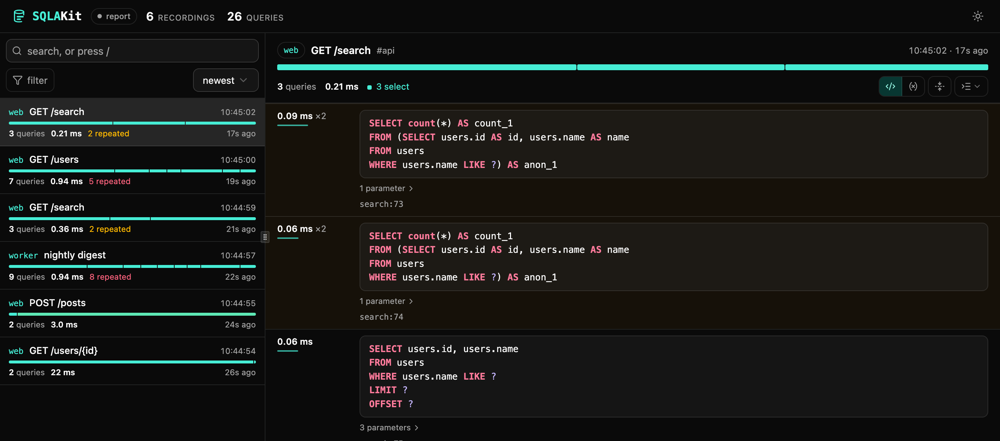

# Debugging

`recording()` shows what queries a block ran, how long they took, and which
ones ran more than once:

```python
with db.recording("GET /users") as record:
    build_report()

record.count  # 12
record.milliseconds  # 8.4
record.duplicates  # statements that ran more than once, grouped by SQL
record.slowest
print(record)  # the statements, numbered and timed
```

The block attaches the listeners when it starts and removes them when it ends,
so nothing is recorded outside the block. Blocks can nest, and each one records
only the statements that ran inside it. Statements from other tasks are not
counted. Under `asyncio` the block is still a plain `with`, because recording
only listens and does not run queries.

A recording skips transaction control. `BEGIN` and `COMMIT` reach a cursor on
some drivers and not on others, so counting them would give the same code
different numbers on `SQLite` and `PostgreSQL`.

## One line per block

```python
import logging

logger = logging.getLogger(__name__)

with db.recording(f"{request.method} {request.url.path}", logger=logger):
    response = await call_next(request)
```

`SQLAKit` logs one line when the block ends, and the log level depends on the
numbers. INFO for a quiet block. WARNING at more than five statements, a
slowest statement over 100ms, or any repeats. ERROR at more than twenty
statements, a slowest statement over half a second, or more than five repeats.
The time thresholds apply to the slowest statement, not to the block as a
whole.

`logger=` calls `Recording.log`, and the thresholds are its `busy`, `slow` and
`repeated` arguments. To change them, or to set the level yourself, leave
`logger=` out and call it directly:

```python
with db.recording("GET /users") as record:
    build_report()

record.log(logger, busy=50, slow=200.0)  # ERROR from 50 statements or 200ms
record.log(logger, level=logging.INFO)  # or always INFO
```

The log record carries the same numbers as fields, for structured logging:

```python
{
    "queries": 12,
    "milliseconds": 8.4,
    "slowest_milliseconds": 3.1,
    "duplicated": 4,
    "databases": ("default",),
    "label": "GET /users",
}
```

## Every request, in development

An `ASGI` middleware that records each request takes a few lines. Wrap it in a
`settings.DEBUG` check so the profiling stays out of production:

```python
import logging

logger = logging.getLogger(__name__)


class QueryLog:
    def __init__(self, app: ASGIApp) -> None:
        self.app = app

    async def __call__(self, scope: Scope, receive: Receive, send: Send) -> None:
        if scope["type"] != "http":
            await self.app(scope, receive, send)
            return

        request = Request(scope)
        label = f"{request.method} {request.url.path}"

        with db.recording(label, logger=logger):
            await self.app(scope, receive, send)


if settings.DEBUG:
    app.add_middleware(QueryLog)
```

The log then shows one line per request, and the problematic requests stand
out by level:

```text
INFO     GET /health: 0 queries in 0.0ms
INFO     GET /users/42: 2 queries in 3.1ms
WARNING  GET /users: 14 queries in 41.7ms (12 repeated)
ERROR    POST /import: 240 queries in 1841.2ms (238 repeated, slowest 612.4ms)
```

When a line like the last one appears, turn on `stacks=True`, and the
recording will include the line of your code that issued the repeated query.

## The debug server

`sqlakit debugserver` serves a page that fills as the recordings arrive:

```console
$ sqlakit debugserver
SQLAKit debug server on http://localhost:5555

Send recordings to it:

  │  with db.recording("GET /users", debugserver=("localhost", 5555)):
  │      list_users()
```



The recordings are listed on the left, newest first. The one you pick opens on
the right: every statement, how long it took, how often it repeated, and the
line of your code behind it. The bar across the top is the block's time, a
segment per statement, coloured by what the statement was.

The search reads fields as well as words: `app:web`, `tag:api`, `label:users`,
`table:users`, `kind:insert`, `db:warehouse`, `trace:views.py`, `queries:>10`,
`ms:>50`, `repeated:>0`. A field about statements narrows the statements
shown, not only which recordings are listed. `filter` counts what there is to
narrow by, and picking a count writes the field into the search.

Three buttons sit above the statements. The first shows the SQL as the
database ran it, or with the parameters in it, ready to paste into a client.
The second lists a repeated statement once, with a count of the times it ran.
The third is the layout: by clause, or by a formatter, with the indent and the
case of the keywords beside it.

One server watches several applications, and a recording says which one ran
it:

```python
from sqlakit import DebugServer

with db.recording(
    "GET /users",
    debugserver=DebugServer("localhost", 5555, app="web", tags=("api",)),
):
    list_users()
```

The server holds the last 200 recordings in memory and writes nothing to disk.
Sending runs on a thread of its own, so a block never waits on it, and a
recording that cannot be delivered is dropped rather than raised.

### The queries a test run made

`--sqlakit-report` writes the same page as a file, with the recordings inside
it, so it opens without a server:

```console
$ pytest --sqlakit-report
sqlakit wrote /app/sqlakit-20260901-224817.html
```

Every test marked `db` is one recording in the list. The test is the label,
the file it lives in is the application, and its other markers are its tags.
Stacks are on, so each statement carries the line of the test, or of the code
under test, that issued it. `--sqlakit-report=build/queries.html` writes where
you say instead.

A suite writes rows to set the scene, and those writes are not what the test
is about. Name the file that writes them, and the queries it runs stay out of
the report, which then holds what the code under test ran:

```toml
[tool.pytest.ini_options]
sqlakit = true
sqlakit_skip_queries_from = ["tests/factories.py"]
```

`db.recording(..., skip_queries_from=[...])` does the same outside a test.

The marker and the fixtures behind it are on the [testing](testing.md) page.

## Printed SQL

`echo=True` prints the block's statements when it ends. That's useful in a
script or a notebook, where you have no logger set up:

```python
with db.recording(echo=True), db.connect():
    build_report()
```

```sql
3 queries in 12.4ms (2 repeated)
   1    4.2ms
        SELECT users.id, users.name FROM users WHERE users.team = ?
```

`print(record)` prints one line per statement, which works well for a block
that ran forty of them. When you want a statement formatted over several
lines, use `pretty`:

```python
print(record.pretty)  # every statement, formatted over several lines
print(record.slowest.pretty)  # only the slowest statement
```

```sql
   1    4.2ms
        SELECT users.id,
               users.name
        FROM users
        WHERE users.team = ?
        ORDER BY users.name
```

Formatting requires `sqlakit[debug]`, which installs `sqlparse`. Without it
you get the statement as it ran, on one line. A missing extra isn't an error.

If your application prints with [rich](https://rich.readthedocs.io), the SQL
is coloured as well: a recording and a statement can both be rendered by
`rich`, and `SQLAKit` itself doesn't import it. `echo=True` and `record.echo()`
colour the output the same way when `rich` is installed, and print plainly
when it is not.

```python
from rich import print

print(record)
```

## The code behind a query

```python
with db.recording(stacks=True) as record:
    render(dashboard)

record.statements[0].stack  # the frames of your code that led to it
```

That turns "this ran 40 times" into a line number. `SQLAKit` collects the
stack with `traceback.extract_stack()` on every statement, which is expensive
enough to be off by default. Turn it on when you're chasing an N+1.

## Multiple databases

`db.recording()` on the registry covers every database it holds, and each
statement records which one ran it:

```python
with db.recording() as record:
    move_the_reports()

record.databases  # ("default", "warehouse")
```

`db["warehouse"].recording()` watches that one alone, and `using` names the
ones to watch when there are more than two:

```python
with db.recording(using=["default", "warehouse"]) as record:
    move_the_reports()
```

One block covers them all, so a middleware opens one, not one per database.
A block per database sends the debug server a recording per database, each
under the same label, and each holding a part of what the request ran.

A database you build yourself is called `default` in a recording until you
name it. Name it, and two of them are told apart:

```python
warehouse = Database(WAREHOUSE_URL, alias="warehouse")
```

A registry names the databases it holds after the aliases they are registered
under, so this is for a database you keep yourself.

Two databases outside a registry report together by writing into one
recording, which carries the label:

```python
record = Recording(label="GET /users")

with db1.recording(into=record, debugserver=SERVER), db2.recording(into=record):
    handle_request()
```

The debug server gets that recording once, whether one block names it or both
do.

## Queries in a test

`assert_queries` is the same recorder with an assertion around it, and it
lives next to `recording()` on the database. The next page covers it:

```python
with db.assert_queries(2):
    render_dashboard()
```

Next: [testing](testing.md), where the same recorder is used as an assertion
in tests.
